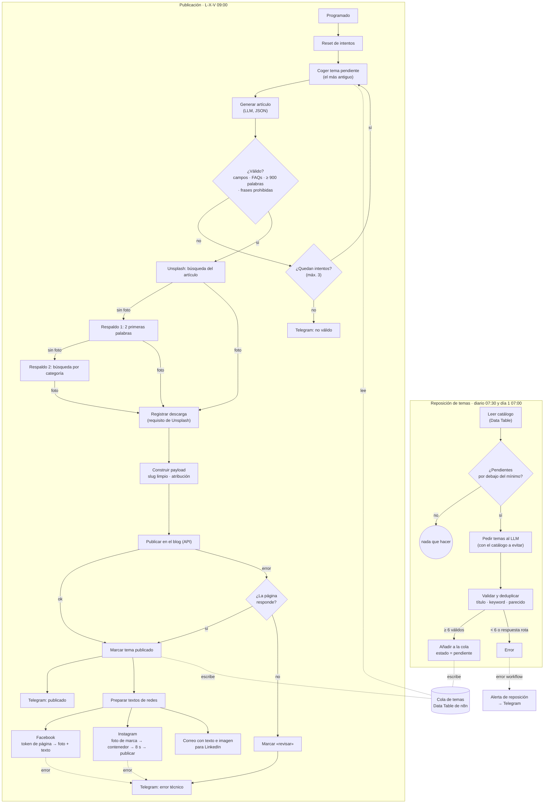

# Blog automático con IA · n8n, LLM, Unsplash, Meta y Telegram

**Resultado en vivo:** https://circoestudio.com/blog

> **Proyecto propio de circo estudio.** Sistema que mantiene el blog y las redes de la marca con contenido nuevo tres veces por semana, sin intervención manual, y que avisa por Telegram de cada publicación o problema. Incluye una [plantilla importable de n8n](snippets/blog-automatico.n8n.json) del flujo principal y los fragmentos más interesantes.

## El problema

Un blog con contenido útil y constante ayuda a posicionar una web de servicios y alimenta las redes sociales. Pero en un estudio pequeño, **escribir, buscar imagen, maquetar, publicar y compartir** cada artículo se come horas que compiten con el trabajo de clientes. Lo que suele pasar:

- se publica a rachas y el blog se queda parado semanas;
- no hay un plan de temas, así que se repiten ideas o se escribe lo primero que se ocurre;
- las redes se quedan sin actualizar porque es otro paso más;
- y si se automatiza sin control, se acaba publicando contenido flojo, repetido o con datos inventados.

## La solución

Tres flujos de n8n que funcionan solos:

1. **Publicación** (lunes, miércoles y viernes a las 9:00):
   1. coge el siguiente tema pendiente de una **cola**;
   2. genera el artículo con un **modelo de lenguaje**;
   3. lo **valida**, y si no pasa lo vuelve a generar, hasta 3 intentos;
   4. busca una **imagen** en Unsplash, con **dos búsquedas de respaldo**;
   5. lo publica en el **blog** mediante su API;
   6. comprueba que la página es accesible;
   7. lo comparte en **Facebook** e **Instagram**, con la foto adaptada a la marca;
   8. envía por **correo** el texto y la imagen para LinkedIn;
   9. avisa por **Telegram** del resultado.
2. **Reposición de temas** (cada día a las 7:30 y el día 1 de cada mes a las 7:00): si la cola baja de un mínimo, pide temas nuevos al modelo, **descarta los duplicados** frente a todo el catálogo y rellena la cola.
3. **Alerta de reposición**: si la reposición falla, avisa por Telegram. Es el *error workflow* del flujo anterior.

## Arquitectura

## Decisiones técnicas

### Una cola de temas, no temas al azar
Los temas viven en una **tabla de n8n** (Data Table) con estado `pendiente`, `publicado` o `revisar`, la URL publicada y la fecha. El flujo de publicación siempre coge **el pendiente más antiguo**.

- **El calendario es predecible:** se ve qué va a salir y se puede reordenar o editar a mano.
- **Cada tema lleva su keyword principal, sus secundarias y el servicio relacionado**, así que el artículo tiene intención de búsqueda y enlaza a la página correcta.
- **Queda historial:** lo publicado sirve después para no repetir.

### Reposición automática con un mínimo y un máximo
La cola se rellena sola. Cada día se comprueba y, si quedan **menos de 6** pendientes, se repone hasta **18**. El día 1 de cada mes se repone siempre que no esté llena.

En el prompt se pasa el catálogo existente (los últimos 400 temas) para que el modelo no repita. El reparto por categorías y las rutas de servicio están fijados.

### Deduplicación en código, no solo en el prompt
Aunque se le pida, el modelo reformula temas que ya existen. Por eso cada propuesta pasa por un filtro determinista:
1. **título normalizado** idéntico (sin tildes ni signos);
2. **misma keyword** principal;
3. **parecido de palabras** (Jaccard ≥ 0,72 sobre palabras de más de 3 letras), frente al catálogo y frente a los otros temas de la misma tanda.

Además valida la categoría, que la ruta del servicio sea coherente, las longitudes y que no haya promesas del tipo «en 5 minutos». Si quedan **menos de 6** temas válidos, **falla a propósito**: la cola existente no se toca y el flujo de alerta avisa por Telegram.

→ [snippets/deduplicar-temas.js](snippets/deduplicar-temas.js)

### Validar antes de publicar y reintentar el mismo tema
El artículo se genera como **JSON con esquema fijo**: título, slug, metadatos SEO, extracto, cuerpo HTML, FAQs, búsqueda de imagen y servicio relacionado. Antes de publicar se comprueba:
- que el JSON se puede leer;
- que están todos los campos y al menos una FAQ;
- que el texto llega a **900 palabras** (el prompt pide más de 1200, así que hay margen);
- que no hay frases que delaten una respuesta de «asistente» («como modelo de lenguaje», «lo siento»…).

Si no pasa, se vuelve a generar **el mismo tema**, hasta **3 intentos** en total. El contador vive en la *static data* del flujo y se reinicia en cada ejecución programada. Si los tres fallan, llega un Telegram con el motivo y el tema sigue pendiente para la siguiente vez.

→ [snippets/validacion-y-reintentos.js](snippets/validacion-y-reintentos.js)

### Un prompt que no deja inventar
El prompt fija los **únicos datos** que el artículo puede afirmar (servicios, condiciones y zona), prohíbe cifras y resultados inventados, cierra la lista de **rutas internas** permitidas y exige la extensión por secciones y párrafos, no solo por número de palabras.

→ [snippets/prompt-articulo.md](snippets/prompt-articulo.md)

### Imagen con dos respaldos
Una búsqueda muy concreta en un banco de imágenes a veces no devuelve nada, y un artículo sin imagen queda mal en el blog y no se puede compartir en Instagram. Por eso hay tres intentos, de más a menos específico:
1. la búsqueda que propone el propio artículo (`imagen_query`, en inglés);
2. solo sus dos primeras palabras;
3. una búsqueda genérica según la categoría.

Además se **registra la descarga** en Unsplash y se guarda la **atribución** del autor con parámetros UTM, como piden las condiciones de su API.

### Comprobar la página si la publicación falla
Si la llamada a la API del blog da error, no se asume que el artículo no se ha creado: puede haberse guardado y fallar solo la respuesta. Se hace un `HEAD` a la URL pública:
- **si responde**, se marca como publicado;
- **si no**, se marca como `revisar` y llega un aviso.

Así no se duplica el artículo en el siguiente intento ni queda un tema «pendiente» que en realidad ya está publicado.

### Redes en paralelo y LinkedIn a mano
- **Facebook:** con el token de página, que se obtiene en cada ejecución, se publica una foto con el texto y el enlace.
- **Instagram:** se prepara la foto cuadrada (1080×1080), un endpoint propio le aplica un **estilo de marca**, se crea el contenedor, se esperan 8 segundos a que Meta lo procese y se publica.
- **LinkedIn:** no se automatiza. Llega un **correo** con el texto listo para copiar, la imagen adjunta y el artículo completo para revisarlo.

Las tres ramas van en paralelo, y los errores de Facebook e Instagram acaban en el mismo aviso de Telegram.

### Telegram como panel de control
Cada ejecución termina en un mensaje: **publicado** (con título y enlace), **no válido** (con el motivo) o **error técnico** (con el id de ejecución). No hace falta entrar en n8n para saber si hoy ha salido el artículo.

### Secretos solo en credenciales
Todas las claves (modelo, Unsplash, API del blog, Meta, Telegram y SMTP) están en **credenciales de n8n**. Ningún nodo lleva tokens escritos a mano, y el token de página de Facebook se pide en cada ejecución en lugar de guardarse.

## Estado actual

- Los tres flujos están **activos en producción**. La publicación funciona desde **julio de 2026**, y la reposición automática de temas y su alerta, desde **septiembre de 2026**.
- Frecuencia: **tres artículos por semana** (lunes, miércoles y viernes).
- Artículos publicados: **30** (a 29/09/2026).

## Lo que he aprendido

- **La IA propone y el código decide.** El modelo es bueno generando, pero la calidad mínima, la deduplicación y el «no publicar si algo falla» tienen que ser reglas deterministas, no instrucciones en un prompt.
- **Una cola hace que la automatización sea gobernable.** Poder ver, reordenar y editar los próximos temas cambia «un robot que publica cosas» por «un calendario editorial que se ejecuta solo».
- **Hay que diseñar para el caso en que no se sabe si algo ha funcionado.** Un error en la respuesta no significa que la acción no se hiciera. Comprobar el resultado real (el `HEAD` a la página) evita duplicados y temas mal marcados.
- **Un respaldo de más cuesta poco y evita muchos huecos.** Las dos búsquedas de imagen extra son tres nodos y convierten un fallo habitual en algo que casi no pasa.
- **Los avisos tienen que ser útiles sin abrir nada más.** Un Telegram con el título y el enlace, o con el motivo exacto del fallo, me ahorra entrar en n8n.
- **Automatizar no es automatizarlo todo.** LinkedIn se queda en un correo listo para copiar y pegar, con la imagen adjunta y el artículo para revisar: publicar ahí sigue siendo un gesto manual.
